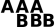
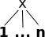
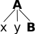

# Complete List of Operators

AQL currently includes the following operators:

| Operator     | Description                | Illustration                                                 | Notes                                                                                                                                                                                                                                       | |
| : -------:   | :-------------------       |       :---------------------------------------------:        | :------------------------------------------------------------------------------------------------------------------------------------------------------------------------------------------------------------------------------------------ | |
| `.`          | direct precedence          |                                      | For non-terminal nodes, precedence is determined by the right-most and left-most terminal children. In corpora with multiple segmentations the layer on which consecutivity holds may be specified with `.layer`                            | |
| `.*`         | indirect precedence        |                                  | For specific sizes of precedence spans, `.n,m` can be used, e.g. `.3,4` - between 3 and 4 token distance; the default maximum distance for `.*` is 50 tokens. As above, segmentation layers may be specified, e.g. `.layer,3,4`             | |
| `^`          | directly near              |  or          | Same as precedence, but in either order. In corpora with multiple segmentations the layer on which consecutivity holds may be specified with `^layer`                                                                                       | |
| `^*`         | indirectly near            |  or  | Like indirect precedence in either order. The form `^n,m` can be used, e.g. `^3,4` - between 3 and 4 token distance; the default maximum distance for `^*` is 50 tokens. As above, segmentation layers may be specified, e.g. `^layer,3,4`  | |
| `>`          | direct dominance           |                                       | A specific edge type may be specified, e.g. `>secedge` to find secondary edges. Edge labels are specified in brackets, e.g. `>[func="OA"]` for an edge with the function 'object, accusative'                                               | |
| `>*`         | indirect dominance         |                                   | For specific distance of dominance, `>n,m` can be used, e.g. `>3,4` - dominates with 3 to 4 edges distance                                                                                                                                  | |
| `_=_`        | identical coverage         |                                 | Applies when two annotations cover the exact same span of tokens                                                                                                                                                                            | |
| `_i_`        | inclusion                  |                                  | Applies when one annotation covers a span identical to or larger than  another                                                                                                                                                              | |
| `_o_`        | overlap                    |                                  | For overlap only on the left or right side, use `_ol_` and `_or_` respectively                                                                                                                                                              | |
| `_l_`        | left aligned               |                                  | Both elements span an area beginning with the same token                                                                                                                                                                                    | |
| `_r_`        | right aligned              |                                 | Both elements span an area ending with the same token                                                                                                                                                                                       | |
| `==`         | value identity             | **A = B**                                                    | The value of the annotation or token A is identical to that of B (this operator does not bind, i.e. the nodes must be connected by some other criteria too)                                                                                 | |
| `!=`         | value difference           | **A ≠ B**                                                    | The value of the annotation or token A is different from B (this operator does not bind, i.e. the nodes must be connected by some other criteria too)                                                                                       | |
| `->LABEL`    | labeled pointing relation  |                              | A labeled, directed relationship between two elements. Annotations can be specified with `->LABEL[annotation="VALUE"]`                                                                                                                      | |
| `->LABEL *`  | indirect pointing relation |                                 | An indirect labeled relationship between two elements. The length of the chain may be specified with `->LABEL n,m` for relation chains of length n to m                                                                                     | |
| `#x:arity=n` | arity                      |                                       | Specifies the amount of directly dominated children that the searched node has                                                                                                                                                              | |
|              |                            |                                                              |                                                                                                                                                                                                                                             | |

## Unsupported operators 

The following operators have been available in the legacy version ANNIS3, but are not yet implemented in the newest ANNIS version.

| Operator          | Description          | Illustration                                    | Notes                                                                                                                                                                                                                                       |
| : -------:        | :------------------- | :---------------------------------------------: | :------------------------------------------------------------------------------------------------------------------------------------------------------------------------------------------------------------------------------------------ |
| `>@l`             | left-most child      |                         |                                                                                                                                                                                                                                             |
| `>@r`             | right-most child     |                        |                                                                                                                                                                                                                                             |
| `$`               | common parent node   |                       |                                                                                                                                                                                                                                             |
| `$*`              | common ancestor node |                     |                                                                                                                                                                                                                                             |
| `#x:tokenarity=n` | tokenarity           |                     | Specifies the length of the span of tokens covered by the node                                                                                                                                                                              |
| `#x:root`         | root                 |                           | Specifies that the node is not dominated by any other node within its namespace       **s**                                                                                                                                                 |