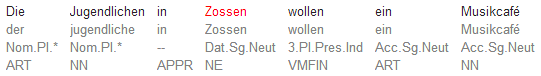
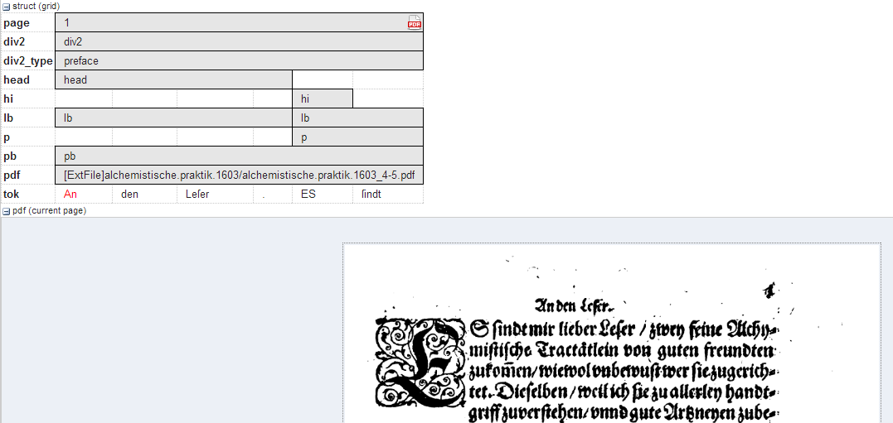

# List of Visualizations

## `kwic` 

Default key-word in context view.

## `tree` 

Constituent syntax tree.

### Mappings

The annotation names to be displayed in non terminal nodes can
be set e.g. using `node_key:cat` for an annotation called *cat* (the default),
and similarly the edge labels using `edge_key:func` for an edge label
called *func* (the default). 
It is also possible to use a different annotation
layer for the leaves of the tree instead of the default tokens by
specifying `terminal_name` for the annotation name and `terminal_ns` for
the namespace. Multiple instructions are separated using semicolons.

## `grid` 

Annotation grid, with annotations spanning multiple tokens.

### Mappings

It is possible to specify the order of annotation layers in each grid.
Use `annos: anno_name1, anno_name2, anno_name3` to specify the
order or annotation layers. If `annos:` is used, additional annotation layers
not present in the list will not be visualized. If mappings is left empty,
layers will be ordered alphabetically. It is also possible to add
annotations applying to the tokens to the visualization, rather than only
span element annotations, by using `tok_anno:true`. Finally, you may
hide the tokens that normally appear at the bottom of the grid using
`hide_tok:true`.

## `grid_tree` 
    
A grid visualizing hierarchical tree annotations as ordered grid layers.

***Note:***  all layers represent the same annotation name at different hierarchical depths, marked level: 0,1,2,... etc. on the left

### Mappings

Specify the name of the annotation to be visualized in the
grid with `node_key:name`. Note that all grid levels visualize the same
annotation name at different hierarchical depths.

## `sentstructurejs`

Visualization for token-token alignments between parallel
texts using [SentStructure.js](https://gitlab.cl.uzh.ch/sparcling/SentStructure.js)

### Mappings

Use `alignment_label` to specify the edge annotation name that should be displayed.

## `discourse` 

A view of the entire text of a document, possibly with interactive coreference links.

It is possible to use this visualization to view entire texts even if you do not have coreference annotations)

## `arch_dependency`

Dependency tree with labeled arches between tokens;
requires SVG enabled browser.

### Mappings

To use a different annotation layer (e.g. *my_annotation*) for the leaves of the tree instead of the default tokens,
enter `node_key:my_annotation`.

## `audio`

A linked audio file.

## `video`

A linked video file.

## `pdf` or `pdfdoc`

A linked pdf file, showing either a specific page aligned
with an annotation or an entire pdf document respectively.

### Mappings

It is possible to configure the height of the pdf window
using the `height` instruction (in pixels), as well as the name (`node_key`)
of the node annotation to be used to give individual page numbers
aligned with a span of tokens (relevant for `pdf` only, `pdfdoc` always
shows all pages). The instructions can be combined as follows:
`node_key:pp;height:400`

## `rst` or `rstdoc`

A visualization for rhetorical structure theory annotations,
of either just the search result with context or the entire document
respectively.

### Mappings

The names of rst edges can be configured with the setting
`edge`. Additionally, some graphical parameters can be modified:
`siblingOffet` defines the distance between sibling nodes; `subTreeOffset`
defines the distance between node and parent node; `nodeWidth` defines
the width of a node; `labelSize` defines the font size of a node label;
`edgeLabelColor` specifies an HTML Color for the font color of an edge
label; `nodeLabelColor` specifies an HTML Color for the font color of a
node label.

## `html` or `htmldoc` 

A versatile annotation-triggered css-based visualization
of either the immediate search result context or the entire document
respectively; see the ANNIS HTML Visualization Guide for more
details and some example stylesheets.

### Mappings

You must specify the name of the css stylesheet (*.css)
and configuration file (*.config) for the visualization, which are place in
the ExtData folder of the relANNIS corpus (see HTML Visualization
Guide for details). To configure the stylesheet name, use the value
`config:filename`, where filename is the common name of both
the .config and the .css files, without the extension.