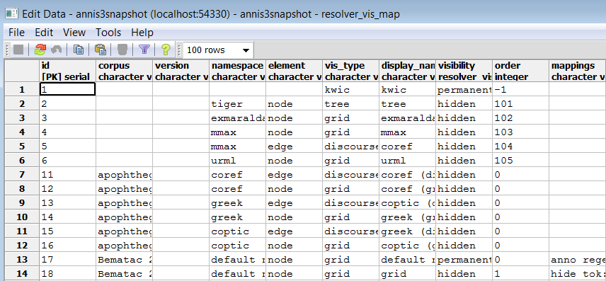

# Configuring Visualizations

By default, ANNIS displays all search results in the Key Word in Context (KWIC)
view in the "Query Result" tab, though in some cases you may wish to turn off this
visualization (specifically dialog corpora, see below). Further visualizations, such as
syntax trees or grid views, are displayed by default based on the following namespaces 
(both nodes an edges can have namespaces):

| Element | Namespace | Visualizer      |
| ------- | --------- | --------------- |
| node    | tiger     | tree visualizer |
| node    | exmaralda | grid visualizer |
| node    | mmax      | grid visualizer |
| edge    | mmax      | discourse view  |

In these cases the namespaces are usually taken from the source format in which the
corpus was generated, and carried over into relANNIS during the conversion. It is also
possible to use other namespaces, most easily when working with PAULA XML. In
PAULA XML, the namespace is determined by the string prefix before the first period
in the file name / paula_id of each annotation layer (for more information, see the
[PAULA XML documentation](http://www.sfb632.uni-potsdam.de/en/paula.html)).
Data converted from EXMARaLDA can also optionally use speaker names as
namespaces. For other formats and namespaces, see the SaltNPepper documentation of
the appropriate format module (details in Chapter 6).
FIXME: link to Chapter 6

In order to manually determine the visualizer and the display name for each namespace
in each corpus, the resolver table in the database must be edited. This can either be
done by editing the relANNIS file `resolver_vis_map.annis` in the corpus directory
before import, or within the database after import. To edit the table in the database
after import, open PGAdmin (or if you did not install PGAdmin with ANNIS then via
PSQL), and access the table resolver_vis_map (it can be found in PGAdmin under
*PostgreSQL 9.[X] > Databases > anniskickstart > Schemas > public > Tables* (for
ANNIS servers replace “anniskickstart” with your database name, determined as
<dbname> in the installation instructions). You may need to give your
PostgreSQL password to gain access. Right click on the table and select *View Data >
View All Rows*. The table should look like this:

The columns in the table (or the file `resolver_vis_map.annis` before import) can be
filled out as follows:
- *corpus* determines the corpora for which the instruction is valid (null values
apply to all corpora, otherwise the name of the relevant corpus)
- *version* is currently unused and reserved for future development
- *namespace* specifies the relevant node or edge namespace which triggers the
visualization
- *element* determines if a node or an edge should carry the relevant annotation
for triggering the visualization
- *vis_type* determines the visualizer module used, see the [list of visualizations](list.md) for possible values
- *display_name* determines the heading that is shown for each visualizer in the interface
- *order* determines the order in which visualizers are rendered in the interface
(low to high)
- *mappings* provides additional parameters for some visualizations: (separate
multiple values using a semicolon), see the [list of visualizations](list.md) for parameters for a specific visualizer
- *visibility* is optional and can be set to:
    - *hidden* - the default setting: the visualizer is not shown, but can be
expanded by clicking on its plus symbol.
    - *permanent* - always shown, not closable
    - *visible* - shown initially, but closable by clicking on its minus symbol.
    - *removed* - not shown; this can be used to hide the KWIC visualization in
corpora which require a grid by default (e.g. dialogue corpora)
    - *preloaded* - like hidden, but actually rendered in the background even
before its plus symbol is clicked. This is useful for multimedia player
visualizations, as the player can be invoked and a file may be loaded
before the user prompts the playing action.