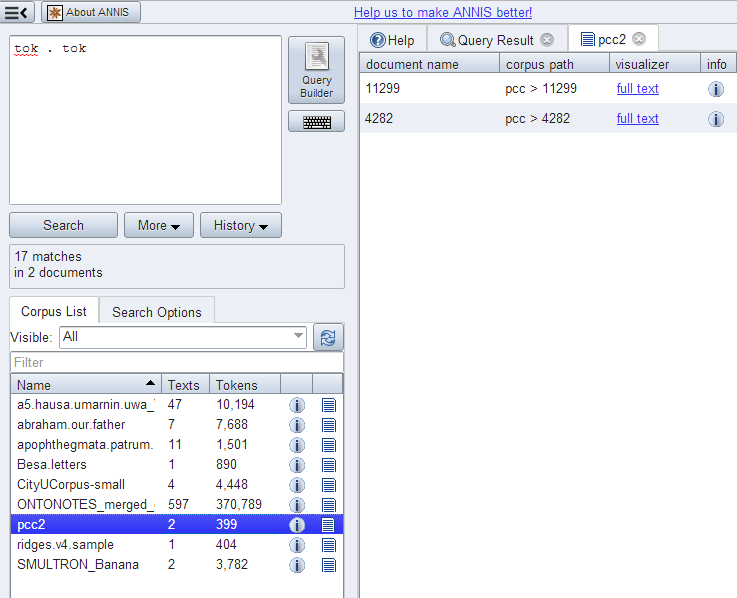

# Document Browser

Starting in ANNIS3.1.X, it is possible to view a list of documents for each corpus and
visualize documents independently of any queries posed by the user. To open the
document browser for a corpus, click on the document icon in the corpus list next to
each corpus. By default, a list as shown below is generated with a link to a plain text
representation of each document.

The default configuration for the document browser is stored in the
`conf/document_browser.json` file in the *back-end configuration*. 
It can be overwritten by a custom the `document_browser.json` file 
placed in the `ExtData` directory of a corpus.

Available keys are:
~~~ini
browse-documents=true|false
browse-document-visualizers= {...}
~~~
Note that the browse-documents configuration has only an effect when it is set
within `corpus.properties`.

## Automatic switch on/off

The ANNIS importer tries to detect corpora containing no underlying token text. This
is usually case if some higher annotation layer is used to represent the base text, e.g. in
dialogue corpora, where the token layer is used as an alignment base for annotations
representing different speakers.
If the `text.annis` import file contains 
only artificial token (which means there are only white spaces) the 
document browser is disabled. 
In the case there exists a `document_browser.json` file
which configures the document browser it will never be disabled by
ANNIS. Also if in the `corpus.properties` the `browse-documents`
properties is set to true, the document browser will stay active.

## Custom visualizer and sorting

It is also possible to use a custom visualizer for browsing a whole
document. The configuration is in JSON-Syntax file named
document_browser.json, which can be add to the ExtData directory of
each corpus.

~~~json
{
  "visualizers": [
    {
      "type": "htmldoc",
      "displayName": "diplomatic text",
      "mappings": "config:dipl"
    },
    {
      "type": "rstdoc",
      "displayName": "rhetorical structure"
    }
  ],
  "metaDataColumns": [
    {
      "namespace": "annis",
      "name": "title"
    },
    {
      "namespace": "annis",
      "name": "genre"
    }
  ],
  "orderBy": [
    {
      "namespace": "annis",
      "name": "title",
      "ascending": "false"
    }
  ]
}
~~~

Explanation in detail:

* *visualizers - type*: Defines which document visualizers are available for a
   corpus. All visualizer from the list above with the suffix "doc" in
   their name are suitable for using as doc visualizer.
* *metaDataColumns* (optional): For every defined metadata field an additional
column is generated in the corpus browser table with the metadata key as a
column header and the metadata value as the table cell value. This is useful for
viewing, and sorting by, different metadata available to the documents. The line
“namespace” can be left out if the namespace is null.
* *orderBy* (optional): In the default state the table is sorted by document name.
Alternatively it is possible to define a custom sort by the metadata fields, even
if the column is not visible. "namespace" and "ascending" are optional (if
namespace is not specified, null is assumed). "ascending" is "true" by default.
