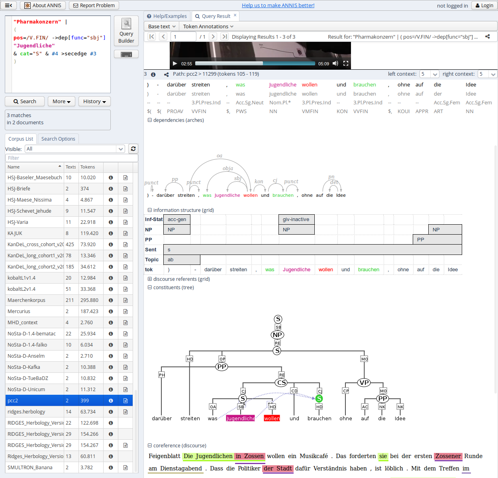

# Introduction

ANNIS is an open source, browser-based search and visualization architecture for
multi-layer corpora, developed at Humboldt-Universität zu Berlin, Georgetown
University and Potsdam University. It can be used to search for complex graph
structures of annotated nodes and edges forming a variety of linguistic structures, such as constituent or dependency syntax trees, coreference, rhetorical structure and parallel alignment edges, span annotations and associated multi-modal data (audio/video). 

This user guide provides an overview of the current ANNIS system, first steps for installing either a local instance or an ANNIS server with a demo corpus, as well as tutorials for converting data for ANNIS and running queries with AQL (ANNIS Query Language).