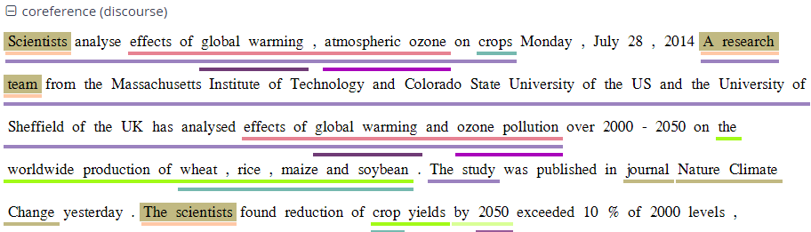

# Searching for Pointing Relations

Pointing relations are used to express an arbitrary directed
relationship between two elements (terminals or non-terminals) without
implying dominance or coverage inheritance. For instance, in the GUM
corpus, elements in the `ref:` namespace may point to each other to
express coreference or anaphoric relations. The following query searches
for two `entity` annotations, which specify whether a discourse referent
is a person, or an animal, a location, an object, an abstract etc.

```
entity="person" & entity!="person" & #1 ->coref #2
```

Using the pointing relation operator `->` with the type `coref`, the
first `entity`, which should be a person, is said to be coreferent with
its antecedent, the second entity, which is not a person. In practice,
this will usually occur due to "bridging", where something like a whole
(e.g. an organization such as a 'research team') implies the existence
of its part (e.g. persons, such as 'the scientists'). To see a
visualization of the coreference relations, open the coreference
annotation layer in the GUM corpus. In the image below, one of the
matches for the above query is highlighted in red (die Seeburger und
einige Groß-Glienicker ... sie 'the Seeburgers and some
Groß-Glienickers... they'). Other discourse referents in the text
(marked with an underline) may be clicked on, causing coreferential
chains containing them to be highlighted as well. Note that discourse
referents may overlap, leading to multiple underlines: Die Seeburger
'the Seeburgers' is a shorter discourse referent overlapping with the
larger one ('the Seeburgers and some Groß-Glienickers'), and each
referent has its own underline. Annotations of the coreference edges of
each relation can be viewed by hovering of the appropriate underline.



The pointing relation operator can also search for longer chains of
coreference, using the asterisk extension shown below:
```
entity="organization" ->coref* entity="person"
```

This finds all organizations that point back to a person at any point
along the preceding coreference chain. It is also possible to specify
annotations of pointing relations, which for coreference in the GUM
corpus mark what kind of coreference is used: anaphoric, cataphoric,
lexical coreference, apposition, or bridging. To find appositions of
place entities, use the following query:
```
entity="place" ->coref[type="appos"] entity="place"
```

Another way to use pointing relations is found in syntactic dependency
trees. The queries in this case can use both pointing relation types and
annotations too, as in the following query:
```
pos=/VV[PZ]/ & tok & #1 ->dep[func="dobj"] #2
```
OR (using a shortcut):
```
pos=/VV[PZ]/ ->dep[func="dobj"] tok
```

This query searches for a present tense lexical verb (with the
part-of-speech VVZ or VVP) and a token, with a pointing relation of the
type 'dep' (for dependency) between the two, annotated with
`func="dobj"` (the function 'direct object'). The result can be viewed
with the arch dependency visualizer, which shows the verb 'shows' and
its object 'location'.

