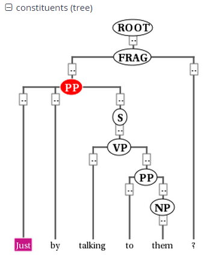

# Searching for Trees

In corpora containing hierarchical structures, annotations such as
syntax trees can be searched for by defining terminal or none-terminal
node annotations, functional dependencies and their values (for
dependencies see see [Searching for Pointing
Relations](aql-pointing.md)). A simple search for
prepostional phrases in the GUM corpus looks like this:
```
const:cat="PP"
```

If the corpus contains no more than one annotation called `cat`, the
optional namespace, in this case `const:`, may be dropped. This finds
all PP nodes in the corpus. You can also search for the NP being
dominated by the PP like this:
```
cat="PP" & cat="NP" & #1 > #2
```

OR (using a shortcut):

```
cat="PP" > cat="NP"
```

To find all PP nodes directly dominating an adverb, you can combine a
search for syntactic category and part-of-speech (pos) values (in this
case "RB" for adverb). The query below gives the shortcut form:
```
cat="PP" > pos="RB"
```


The operator **\>** signifies **direct dominance**, which must hold
between the first and the second element. Once the Query Result tab is
shown you may open the "constituents" annotation layer to see the
corresponding tree.



Note that since the context is set to a number of tokens left and right
of the search term, the tree for the whole sentence may not be
retrieved, though you can change the amount of tokens at the top of each
search result, or for all search results in the Search Options tab. To
make sure that the whole clause is always included, you may want to
specifically search for the clause or sentence dominating the PP. To do
so, specify the sentence in another element and use the **indirect
dominance** ( **\>\*** ) operator:
```
cat="ROOT" >* cat="PP" > pos="RB"
```

If the annotations in the corpus support it, you may also look for edge
labels. Using the following query will find all adverbial modifier NPs,
dominated by some node through an edge labeled ADV. Since we do not know
anything about the modified node, we simply use the `node` element as a
place holder. This element can match any node or annotation in the
graph:
```
node >[const:func="ADV"] cat="NP"
```


Again, the namespace `const:` is optional and only important if there
are multiple 'func' annotations. It is also possible to negate the label
of the dominance edge as in the following query:
```
cat >[func!="TMP"] cat
```
which finds all syntactic categories (value unspecified) dominating
another syntactic category with a label other than "TMP".