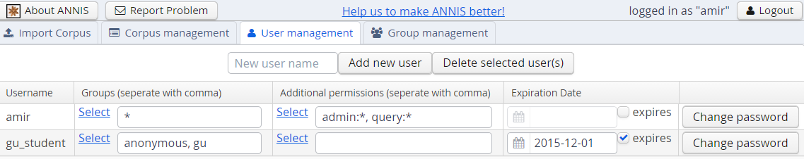

# The administration web interface

The administration web interface allows you to import and delete corpora, as well as to
define users from the ANNIS web application directly. To log into the administration
interface, use the URL of you ANNIS webapp and add /admin or from ANNIS 3.4.X
and above, press the Administration button next to ‘About ANNIS’ (this button is only
shown if you are a logged in administrator). You should see the screen below:

Here you can upload a zipped relANNIS corpus for import and set the e-mail address
in the configuration file. The corpus management tab allows you to select corpora for
deletion:

And finally the user and group management tabs allow you to add or remove users,
give them special permissions, and determine which groups can see which corpora.

These functions edit the files described in the [User Configuration section](import-and-config-user.md). Note that the user management
function treats any file in the users/ directory from the [User Configuration section](import-and-config-user.md) as a user entry, and no
files except for user files may exist in that directory (otherwise the administration
functions will not load correctly).