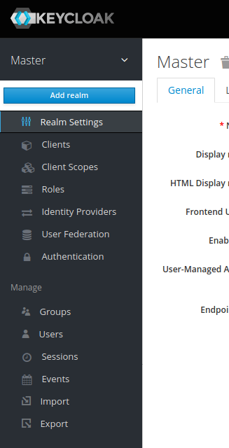
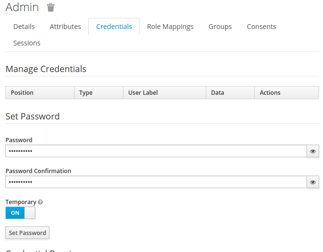
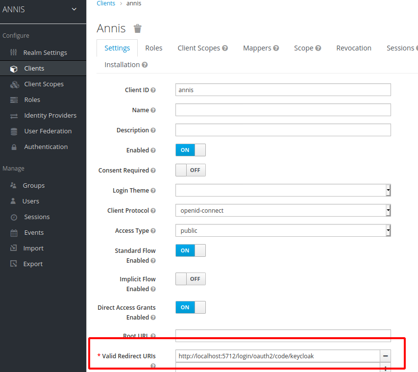

# User Configuration on Server

ANNIS has an authorization system based on [OAuth2](https://www.oauth.com/) which allows handling multiple users on a server installation using an external identity provider service.
A user will see different corpora depending on which groups the user is part of.
**For the desktop version of ANNIS, a single administrator user is automatically created and logged in.**

When using an identity provider, the backend graphANNIS service and the ANNIS frontend needs to be configured to use this service.
Per default, ANNIS uses an embedded graphANNIS service with the configuration located in the home directory of the user running the ANNIS service: `~/.annis/service.toml`.
See the [graphANNIS documentation on authentication and authorization](https://korpling.github.io/graphANNIS/docs/v0.29/rest.html#authentication-and-authorization) for how to use this configuration file to configure the backend.
You can choose from various OAuth2 compatible identity providers, but in the following example we will use a self-hosted [Keycloak](https://www.keycloak.org/) server.

## Configure Login with a self-hosted Keycloak server

### Install and run Keycloak

Follow the ["Getting Started with Keycloak"](https://www.keycloak.org/getting-started) guide to install and run the service.

### Configure Keycloak for ANNIS

Keycloak uses so-called “Realms” to distinguish between different settings.
Download the realm-configuration file for ANNIS from our repository: <https://raw.githubusercontent.com/korpling/ANNIS/master/misc/keycloak-realm-configuration.json>.
We will add a realm for ANNIS by hovering over the realm selection in the top left menu and clicking on “Add realm”.



Then select this file in “Import”.


The import page will fill out the name of the realm and list other settings under “View details“.
Click on “Create“ to create the realm.


In the realm settings, click on “Keys“ and select “Public Key“


The displayed text is a public key that the graphANNIS REST service needs to verify a user presents a valid authorization token.
Add the following the Keycloak public to your `~/.annis/service.toml` file (if it does not exist yet, create it):

```toml
[auth.token_verification]
type = "RS256"
public_key = """
-----BEGIN PUBLIC KEY-----
<insert copied public key from Keycloak here>
-----END PUBLIC KEY-----
"""
```

Now create a first administrator user by selecting “Mange -> Users“ in the main Keycloak menu and clicking on the “Add user“ button on the right.


Fill out the user information and click on “Create“.


After creating the user, switch to the “Credentials“ tab and set a new password.
Make sure to **unselect** the “Temporary“ switch.



Then add the `admin` role to this user by switching to the “Role Mappings“ tab, selecting `admin` under “Available roles“ and click on “Add selected“.


The Keycloak server needs to know which URIs are valid client URIs, got to “Configure -> Clients“, select the “annis” client and replace the `http://localhost:5712` part of the “Valid Redirect URIs“ with the public URI of the ANNIS frontend.



### Configure the ANNIS frontend service

Edit the `annis-gui.properties` file in one of the configuration folders (e.g. `~/.annis/`).

Add the following lines to configure ANNIS to use the Keycloak server:
```properties
spring.security.oauth2.client.registration.keycloak.client-id=annis
spring.security.oauth2.client.registration.keycloak.authorization-grant-type=authorization_code
spring.security.oauth2.client.registration.keycloak.redirect-uri-template=http://localhost:5712/login/oauth2/code/keycloak
spring.security.oauth2.client.provider.keycloak.issuer-uri=http://localhost:8080/auth/realms/ANNIS
```

Replace the `http://localhost:5712/` in the `redirect-uri-template` with the public URL of your ANNIS service.
Also replace the `http://localhost:8080/` part of the `issuer-uri` with the public URL of your Keycloak server (if you are testing this on your local computer, you can leave the values as they are).

ANNIS uses the Spring Security framework for OAuth2 internally.
An overview of the configuration parameters is part of the [Spring documentation](https://docs.spring.io/spring-boot/docs/2.1.9.RELEASE/reference/html/boot-features-security.html#boot-features-security-oauth2-client).

### Start the ANNIS service and test the login

When you start the ANNIS service and open it in the browser, you should now see a “Login“ button.
Click on it and enter the credentials of the previously created adminstrator user.

Logging in should enable the “Administration“ interface, which you can use to assign groups to corpora.
The imported realm already has the `internal` group which you can assign to users that e.g. should have access to internal corpora.
You can create new groups and users in the Keycloak interface, assign users to groups and assign corpora to groups in the ANNIS interface.

### Integrating third party identity providers

Keycloak also supports integrating third party identity providers like e.g. GitHub or Google.
You can manage them in the “Identity Providers“ menu in Keycloak.
The “User Federation“ menu allows to add LDAP servers which can be used as source for user accounts.