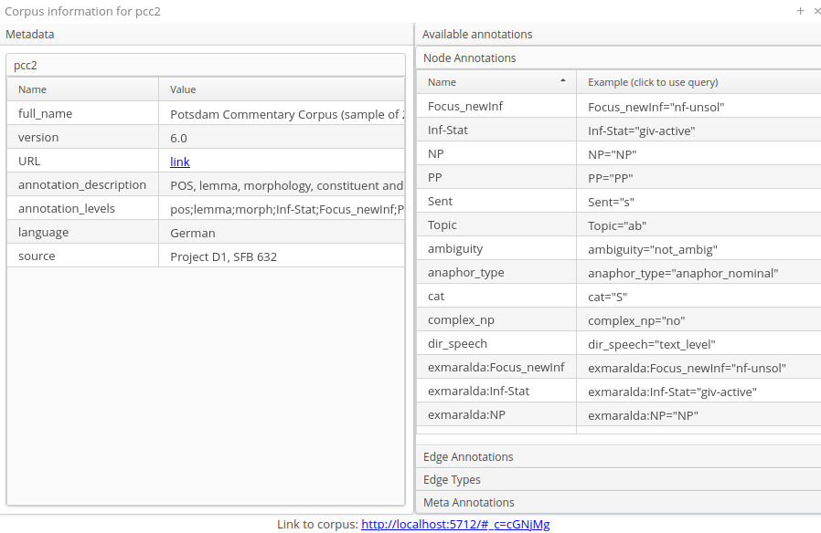

# Configuring Settings for a Corpus

For each imported corpus, there is a sub-folder in the corpus data folder (per default `~/.annis/v4/`) with the corpus name as folder name.
In addition to the actual annotations, this corpus folder contains a configuration file named `corpus-config.toml` with all corpus specific configuration.[^old-annis-configs]

The configuration file is in the human-readable and editable [TOML format](https://toml.io/) and can be edited in any text editor.
TOML uses so-called [tables](https://toml.io/en/v1.0.0-rc.2#table) to specify sub-sections of the configuration.
Inside each table, normal key value pairs like in the Java Properties file format can be used.
E.g. the following configuration file has the tables/sections `[context]` and `[view]`
```toml
[context]
# The default context in the user interface
default = 5
# Available context sizes
sizes = [1, 2, 5, 10]
# Maximal context size in tokens
max = 50

[view]
page_size = 10
```

## Maximal Context Size, Context Steps and Result Page Sizes

The maximal context size of ±n tokens from each search result (for the KWIC view,
but also for other visualizations) can be set for a corpus using the `max` key in the `[context]` table.
To configure which steps are actually shown in the front-end (up to the maximum
allowed) add the key `sizes` and use an [array](https://toml.io/en/v1.0.0-rc.2#array) as value. 
By default, the context steps 1, 2, 5 or 10 tokens are available. 
The default context selected when the corpus is queried, can be set with the `default` key.


## Setting Default Context and Segmentations

In corpora with multiple segmentations, such as historical corpora with conflicting
diplomatic and normalized word form layers, it is possible to choose the default
segmentation for both search context and the KWIC visualization. To set the relevant
segmentations, use the following settings in the `corpus-config.toml` file.

~~~toml
[context]
# The default segmentation used to generate the context
segmentation="SEGNAME"

[view]
# The default segmentation to show in the user interface (e.g. the KWIC)
base_text_segmentation="SEGNAME"
~~~

For more details on segmentations, see the ANNIS Multiple Segmentation Corpora
Guide.

## Order of metadata annotations

In some views, like the corpus information window (accessible by clicking on the
info icon in the corpus list), metadata annotations are shown. Per default, they
are displayed in alphabetical order. Use the `corpus_annotation_order` parameter
of the `[view]` section to explicitly define the order.

```toml
[view]
corpus_annotation_order = ["full_name", "version"]
```

For the pcc2 corpus, this would change display of the metadata in the corpus
information view:



All non-mentioned metadata annotations are listed behind the defined ones in
alphabetical order.

## Adding Example Queries

User created example queries are stored in the file `corpus-config.toml` as an [array of tables](https://toml.io/en/v1.0.0-rc.2#array-of-tables).
Each example query starts with the line `[[example_queries]]` followed by some key value pairs.

```toml
[[example_queries]]
query = "\"statisch\""
description = "search for the word \"statisch\""
query_language = "AQL"

[[example_queries]]
query = "/.*lich/"
description = "Search for words ending with \"lich\" (regular expression)"
query_language = "AQL"

[[example_queries]]
query = "\"so\" & \"statisch\" & #1 . #2"
description = "search for the word \"so\" followed by the word \"statisch\""
query_language = "AQL"
```


[^old-annis-configs]: In ANNIS 3 the corpus specific configuration was distributed over several configuration files (e.g. the `corpus.properties` file) and database tables (like the `resolver_vis_map.annis` or `example_queries.annis` files).
When importing an relANNIS corpus, the previous corpus configuration files will be mapped to the new format automatically.