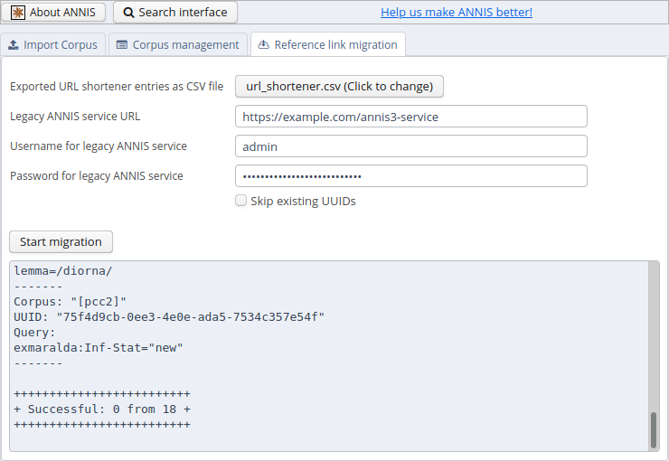

# Migrating from ANNIS 3


These instructions are a guideline for upgrading the installation of ANNIS on a UNIX-like server. 
If you use the [ANNIS Desktop version](desktop.md) 
just download the new version and (re-) import the corpora you need.
Please read [the installation instructions](server.md) first if you
haven't done so yet.


It is currently not possible to migrate user accounts and groups automatically.
You should however be able to import all existing corpora in the relANNIS format and migrate the reference links.


### Download and install the new service

Follow the [installation instructions](server.md) to get the new service running.
You should configure a new port for the ANNIS service if both old and new version run on the same server.
The old service must still be available while migrating the reference links (but not after).

### Import old corpora

You should export a list of all existing corpora from the old service and use the new [ANNIS command line tool to import](../import-and-config/import.html#importing-a-corpus-using-the-command-line) them again.

This can take a long time, so if you use SSH you might want use a program like e.g. [Byobu](http://byobu.org/) to start a terminal that continues to run process in the background even if the connection is interrupted.


### Migrate reference links

ANNIS aims to be as backward-compatible as possible, but we need to make sure the reference links actually point not only to the same queries and corpora, but show exactly the same result [^sameresult].

If you want to migrate the reference links, you have to export them as CSV files from ANNIS 3 using its command line interface.
```.sh
annis-admin.sh dump url_shortener url_shortener.csv
```
You can select any output file in a location of your choice.


In the "Administration" user interface, there is a tab that allows to migrate reference links.
To do so, ANNIS will execute each query in the given CSV file both on the old ANNIS service and on the new one.
This is why you need to give the server URL and adminstration account information as parameters.



After filling out all necessary information and clicking on "Start migration", ANNIS will compare the results by executing the queries both on the old and the new ANNIS service.
If both results are exactly the same, it migrates the reference link to the new system.
The command will give a summary how many reference links have been migrated successfully and which kind of errors occurred on the other ones.
If you think a specific query triggers a bug in the new version of ANNIS, please check if there is already a bug report on [https://github.com/korpling/ANNIS/issues](https://github.com/korpling/ANNIS/issues) or open a new one.

Some queries only work in the same way in [compatibility query mode](./aql-compatibility-mode.md), these will be rewritten automatically.
The user will be able to execute this query normally, but sees a warning that its using deprecated functions of the query language.

For queries where both the normal and the compatibility mode don't return the same results, they are still migrated but a clear warning is shown to the user before execution, that this query is known to give different results compared to the previous version of ANNIS.


[^sameresult:] Same result means, that the overall count is correct, that the matches have the same Salt IDs and that they are presented in the same order.