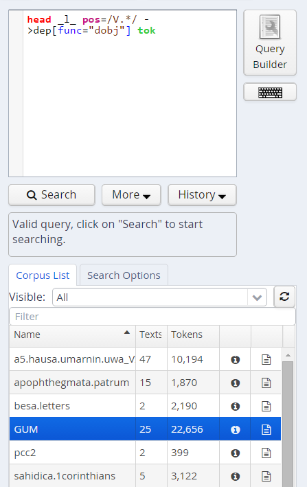
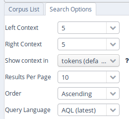

# Search Form

The Search Form can be found on the left of the interface window. It\'s
bottom part shows the list of currently available corpora. By clicking
on the line with the corpus name, it is possible to select which corpora
should be searched in (hold down \'ctrl\' to select multiple corpora
simultaneously). You may also configure groups of corpora or type in the
filter box to view subsets of the corpora.

The "AQL" field at the top of the form is used for inputting queries
manually (see the tutorials on the ANNIS Query Language from the ANNIS
website). As soon as one or several corpora are selected and a query is
entered or modified, the query will be validated automatically and
possible errors in the query syntax will be commented on in the
"Status" box below (which says "valid query" in the image above).

Once a valid query has been entered, pressing the \"Search\" button will
retrieve the number of matching positions and documents in the selected
corpora in the Status box and open the Result tab to display the first
set of matches.

In order to get more control over the search you can click on "Search
Options" to unfold more detailed search options. The context
surrounding the matching expressions in the result list ist determined
by the "Left Context" and "Right Context" options and can be changed
on each side (by default up to 20 tokens). You can also configure how
many results are shown per page, what order results are shown in
(ascending, descending or random) and for some corpora, you can select
alternative segmentation layers to visualize data (relevant for
languages with multiple tokens per word form, etc., such as Arabic).
Entire texts can also be viewed using special document visualizations or
by clicking on the document icon next to each corpus name, if available.

The "Query Language" option allows to switch between the default AQL dialect 
and an [compatibility mode](aql-compatibility-mode.md) emulating the behavior of the older ANNIS3.
Make sure to use the latest version for all new queries.