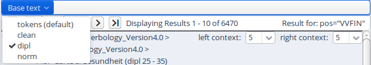
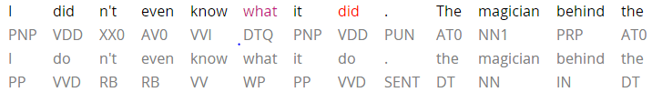

# Result Window

The result window shows search results in pages of 10 hits each by
default (this can be changed in the Search Form). The toolbar at the top
of the window allows you to navigate between these pages. The \"Token
Annotations\" button on the toolbar allows you to toggle the token based
annotations, such as lemmas and parts-of-speech, on or off for you
convenience. You can use hyperlinks to your queries by copying the
current browser URL for e-mail or citation purposes, allowing others to
reproduce your query.

If your corpus contains multiple alternative text layers or
segmentations (e.g. normalized and un-normalized text), you may switch
between these on the fly by using the \"base text\" menu.

The result list itself initially shows a KWIC (key word in context)
concordance of matching positions in the selected corpora, with the
matching regions marked in color and the context in black on either
side. Colors in the result match the colors of search expressions in the
search box (red for the search item \#1, purple for \#2, etc.).

Context can be adjusted for individual search results up to the maximum
allowed for the current corpus. Token annotations are displayed in gray
under each token, and hovering over them with the mouse will show the
annotation name and namespace. More complex annotation levels can be
expanded, if available, by clicking on the plus icon next to the
level\'s name, e.g. dependencies and referent information for the
annotations in the dependency tree and grid views in the picture below.

